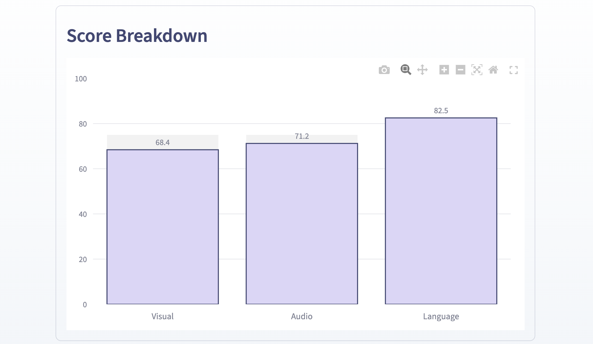

# 🎙️ Vocalytics  
### Speech Intelligence, Powered by AI


Vocalytics is an **AI-powered speech analysis platform** that evaluates communication performance from video recordings.

The system analyzes **visual presence, vocal delivery, and language structure** to generate a **confidence score and actionable feedback**.

It transforms speech into **measurable performance insights** to help users improve public speaking, presentations, and interviews.

---

## 🚀 Demo

### 🎬 Application Walkthrough

<!-- ADD A SHORT GIF HERE -->
<!-- Example: uploading video → analysis → dashboard -->


---

## 🖥️ Application Interface

### Upload & Analysis Interface

<!-- ADD SCREENSHOT OF MAIN PAGE -->


Users can upload a speaking video and receive an **AI-generated performance report**.

---

### AI Performance Dashboard

<!-- ADD DASHBOARD SCREENSHOT -->


The dashboard presents a **confidence score**, **performance breakdown**, and **growth insights**.

---

### Performance Visualization

<!-- ADD RADAR CHART SCREENSHOT -->




Interactive charts visualize the user's performance across key communication dimensions.

---

## ✨ Key Features

### 🎥 Video-Based Analysis
Upload a speaking video and receive AI-generated insights.

### 👁️ Visual Presence Detection
Analyzes:
- Eye contact
- Head posture
- Facial engagement
- Camera presence

### 🎙️ Audio Delivery Analysis
Evaluates:
- Speaking pace
- Vocal clarity
- Pauses
- Speech rhythm

### 💬 Language Structure Intelligence
NLP models analyze:
- Sentence complexity
- Language flow
- Verbal clarity
- Communication structure

### 📊 Confidence Scoring System
Combines multiple AI signals into a **single performance score**.

### 📈 Performance Visualization
Interactive charts include:
- Radar performance chart
- Score breakdown bars
- Growth insights dashboard

---

## 🧠 AI Processing Pipeline

Vocalytics processes speech through a **multi-stage AI pipeline**.

```
Video Input
│
├── Frame Extraction
│
├── Visual Analysis (MediaPipe)
│   ├── Eye Contact
│   ├── Posture
│   └── Engagement
│
├── Audio Extraction
│
├── Speech Recognition (Whisper)
│   └── Transcription
│
├── NLP Analysis
│   ├── Sentence Flow
│   ├── Language Clarity
│   └── Speech Structure
│
├── Audio Analysis
│   ├── Speaking Pace
│   ├── Pause Patterns
│   └── Delivery Quality
│
└── Final Confidence Score
    │
    └── AI Feedback Report
```

---

## 🧩 Project Architecture

```
Vocalytics/
│
├── app.py
│
├── backend/
│   ├── audio_analyzer.py
│   ├── visual_analyzer.py
│   ├── nlp_analyzer.py
│   ├── scorer.py
│   ├── feedback.py
│   ├── video_processor.py
│   └── utils.py
│
├── ui/
│   ├── hero.py
│   ├── upload_section.py
│   ├── trust_bar.py
│   ├── pipeline_execution.py
│   ├── dashboard.py
│   └── sidebar.py
│
├── assets/
│   ├── icons/
│   ├── logos/
│   ├── mascot/
│   └── screenshots/
│
├── styles/
│   └── css.py
│
└── requirements.txt
```

---

## 🧠 AI Scoring Methodology

Vocalytics converts multiple communication signals into a single **Confidence Score (0–100)**.

The scoring model combines **visual, vocal, and linguistic signals** extracted from the video.

---

### 👁 Visual Signals
Computer vision models analyze speaker presence and engagement.

**Examples:**
- Eye contact consistency
- Head stability
- Facial engagement
- Camera alignment

These signals estimate how confidently the speaker appears on camera.

---

### 🎙 Audio Signals
Speech delivery is evaluated using acoustic analysis.

**Key metrics include:**
- Speaking pace (words per minute)
- Pause frequency
- Vocal rhythm consistency
- Delivery smoothness

This stage evaluates **how the speaker sounds**.

---

### 💬 Language Signals
Natural Language Processing analyzes the **structure of speech**.

**Examples:**
- Sentence complexity
- Clarity of phrasing
- Idea progression
- Linguistic coherence

This measures **how effectively ideas are communicated**.

---

### 📐 Scoring Formula

Each category contributes to the final score:

```
Final Confidence Score = 
    (Visual Score × 0.35) + 
    (Audio Score × 0.35) + 
    (Language Score × 0.30)
```

The weights are designed to reflect the relative importance of:
- Visual engagement
- Vocal delivery
- Linguistic clarity

---

### 📊 Score Interpretation

| Score Range | Performance Level |
|-------------|-------------------|
| 0 – 39      | Finding Your Voice |
| 40 – 54     | Growing Confidence |
| 55 – 69     | Clear & Confident |
| 70 – 84     | Strong Presence |
| 85 – 100    | Next Level Confidence |

---

### 💡 Feedback Generation

Once the score is calculated, Vocalytics generates **structured improvement feedback**.

Each recommendation includes:
- Growth area
- Why it matters
- Practical improvement suggestion

This transforms raw analytics into **actionable communication coaching**.

---

### 📋 Example Output

```
Overall Score: 74
Performance Level: Strong Presence

Growth Areas:
• Maintain stronger eye contact
• Improve speaking pace consistency
• Simplify sentence structure
```

---

### 🎯 Design Goal

The goal of Vocalytics is not only to **measure speaking performance**, but also to **guide improvement through clear insights**.

The system acts as a lightweight **AI communication coach** for speakers, presenters, and professionals.

---

## ⚙️ Tech Stack

### Frontend
- **Streamlit** - Web framework
- **Custom CSS** - Styling
- **Plotly** - Interactive charts

### AI & ML
- **MediaPipe** - Visual analysis
- **OpenAI Whisper** - Speech recognition
- **Scikit-learn** - ML algorithms
- **Librosa** - Audio processing

### Video & Audio Processing
- **OpenCV** - Video processing
- **FFmpeg** - Media conversion
- **NumPy** - Numerical operations

### Data Analysis
- **Pandas** - Data manipulation
- **SciPy** - Scientific computing

---

## 🛠️ Installation

### 1️⃣ Clone Repository

```bash
git clone https://github.com/yourusername/Vocalytics.git
cd Vocalytics
```

---

### 2️⃣ Create Virtual Environment

```bash
python3 -m venv venv
source venv/bin/activate  # On Windows: venv\Scripts\activate
```

---

### 3️⃣ Install Dependencies

```bash
pip install -r requirements.txt
```

---

### 4️⃣ Install FFmpeg

**macOS:**
```bash
brew install ffmpeg
```

**Linux (Ubuntu/Debian):**
```bash
sudo apt install ffmpeg
```

**Windows:**
Download from [ffmpeg.org](https://ffmpeg.org/download.html) and add to PATH

---

### 5️⃣ Run the Application

```bash
streamlit run app.py
```

The app will open in your browser at `http://localhost:8501`

---

## 📈 Future Enhancements

- [ ] Multi-video progress tracking
- [ ] Historical performance dashboard
- [ ] AI coaching recommendations
- [ ] Real-time speaking feedback
- [ ] Emotion and sentiment detection
- [ ] Gesture analysis
- [ ] Multi-language support
- [ ] Custom scoring weights

---

## 📌 Use Cases

Vocalytics can be used for:

✅ **Public speaking improvement**  
✅ **Interview preparation**  
✅ **Presentation training**  
✅ **Sales pitch analysis**  
✅ **Communication coaching**  
✅ **Content creator evaluation**  
✅ **Professional development**

---

## 👨‍💻 Author

**Ritesh**  
*AI/ML Engineer | Data Scientist*

[](https://www.linkedin.com/in/ritesh-ai/)
[](https://github.com/ritesh-devhub)

---

## ⭐ Support

If you find this project useful, consider giving it a **star ⭐**

It helps the project reach more developers and improve the AI community.

---

## 🤝 Contributing

Contributions are welcome! Please feel free to submit a Pull Request.

1. Fork the repository
2. Create your feature branch (`git checkout -b feature/AmazingFeature`)
3. Commit your changes (`git commit -m 'Add some AmazingFeature'`)
4. Push to the branch (`git push origin feature/AmazingFeature`)
5. Open a Pull Request

---

## 📜 License

This project is licensed under the **MIT License** - see the [LICENSE](LICENSE) file for details.

---

## 🙏 Acknowledgments

- OpenAI for Whisper ASR
- Google MediaPipe team
- Streamlit community
- All contributors and supporters

---

<div align="center">

**Made with ❤️ by Ritesh**

*Transforming speech into insights, one video at a time*

</div>
