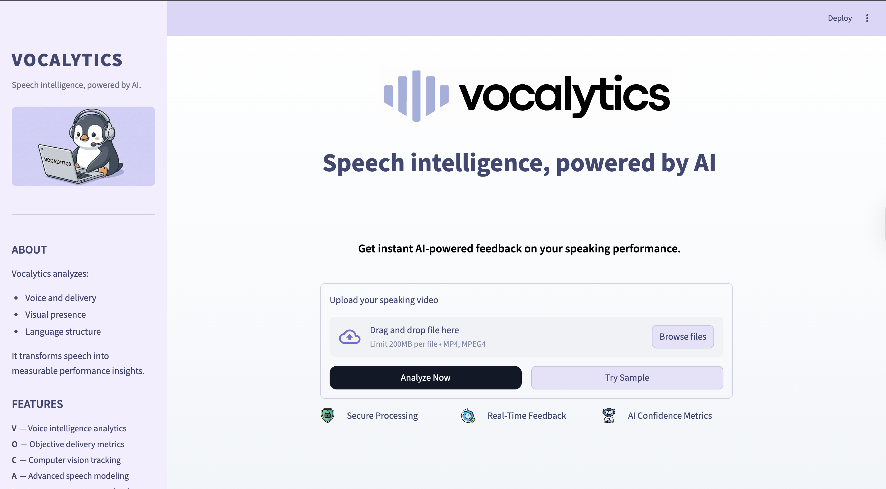
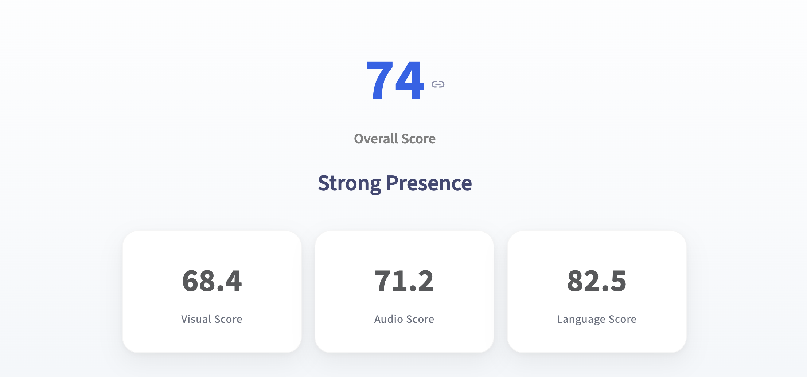
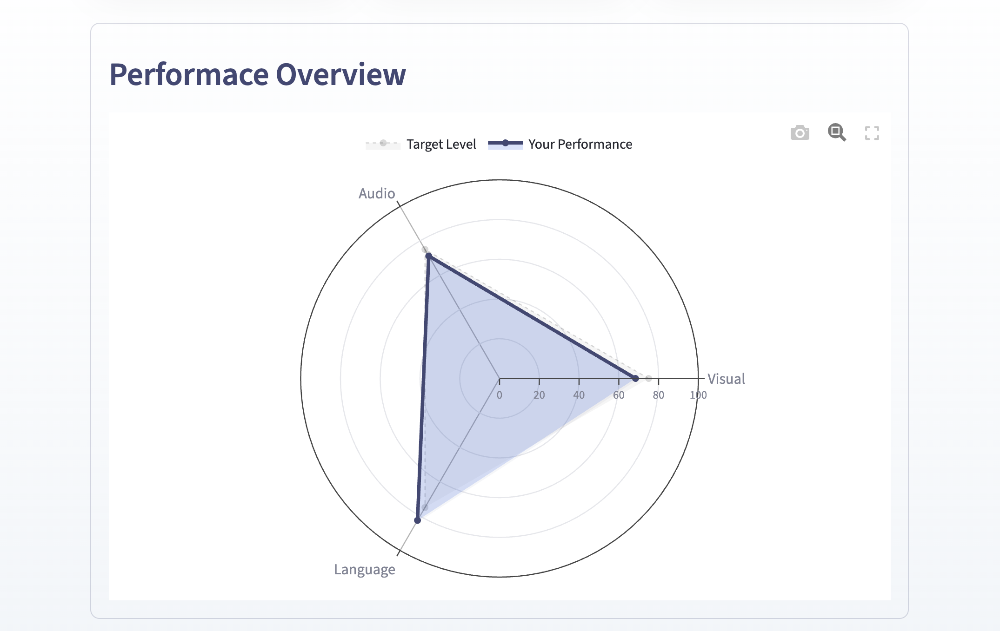

# 🎙️ Vocalytics  
### Speech Intelligence, Powered by AI

Vocalytics is an **AI-powered speech analysis platform** that evaluates communication performance from video recordings.

The system analyzes **visual presence, vocal delivery, and language structure** to generate a **confidence score and actionable feedback**.

It transforms speech into **measurable performance insights** to help users improve public speaking, presentations, and interviews.

---

# 🚀 Demo

### 🎬 Application Walkthrough

<!-- ADD A SHORT GIF HERE -->
<!-- Example: uploading video → analysis → dashboard -->

---

# 🖥️ Application Interface

### Upload & Analysis Interface

<!-- ADD SCREENSHOT OF MAIN PAGE -->

Users can upload a speaking video and receive an **AI-generated performance report**.

---

### AI Performance Dashboard

<!-- ADD DASHBOARD SCREENSHOT -->

The dashboard presents a **confidence score**, **performance breakdown**, and **growth insights**.

---

### Performance Visualization

<!-- ADD RADAR CHART SCREENSHOT -->

Interactive charts visualize the user's performance across key communication dimensions.

---

# ✨ Key Features

### 🎥 Video-Based Analysis
Upload a speaking video and receive AI-generated insights.

### 👁️ Visual Presence Detection
Analyzes:

- Eye contact
- Head posture
- Facial engagement
- Camera presence

### 🎙️ Audio Delivery Analysis
Evaluates:

- Speaking pace
- Vocal clarity
- Pauses
- Speech rhythm

### 💬 Language Structure Intelligence
NLP models analyze:

- Sentence complexity
- Language flow
- Verbal clarity
- Communication structure

### 📊 Confidence Scoring System
Combines multiple AI signals into a **single performance score**.

### 📈 Performance Visualization
Interactive charts include:

- Radar performance chart
- Score breakdown bars
- Growth insights dashboard

---

# 🧠 AI Processing Pipeline

Vocalytics processes speech through a **multi-stage AI pipeline**.
Final Confidence Score =
(Visual Score × 0.35) +
(Audio Score × 0.35) +
(Language Score × 0.30)

The weights are designed to reflect the relative importance of:

- visual engagement
- vocal delivery
- linguistic clarity

---

## Score Interpretation

| Score | Performance Level |
|------|------------------|
| 0 – 39 | Finding Your Voice |
| 40 – 54 | Growing Confidence |
| 55 – 69 | Clear & Confident |
| 70 – 84 | Strong Presence |
| 85 – 100 | Next Level Confidence |

---

## Feedback Generation

Once the score is calculated, Vocalytics generates **structured improvement feedback**.

Each recommendation includes:

- Growth area
- Why it matters
- Practical improvement suggestion

This transforms raw analytics into **actionable communication coaching**.

---

## Example Output

Overall Score: 74
Performance Level: Strong Presence

Growth Areas:

• Maintain stronger eye contact
• Improve speaking pace consistency
• Simplify sentence structure

---

## Design Goal

The goal of Vocalytics is not only to **measure speaking performance**, but also to **guide improvement through clear insights**.

The system acts as a lightweight **AI communication coach** for speakers, presenters, and professio

# 🧠 AI Scoring Methodology

Vocalytics converts multiple communication signals into a single **Confidence Score (0–100)**.

The scoring model combines **visual, vocal, and linguistic signals** extracted from the video.

---

## Feature Categories

### 👁 Visual Signals
Computer vision models analyze speaker presence and engagement.

Examples:

- Eye contact consistency
- Head stability
- Facial engagement
- Camera alignment

These signals estimate how confidently the speaker appears on camera.

---

### 🎙 Audio Signals
Speech delivery is evaluated using acoustic analysis.

Key metrics include:

- Speaking pace (words per minute)
- Pause frequency
- Vocal rhythm consistency
- Delivery smoothness

This stage evaluates **how the speaker sounds**.

---

### 💬 Language Signals
Natural Language Processing analyzes the **structure of speech**.

Examples:

- Sentence complexity
- Clarity of phrasing
- Idea progression
- Linguistic coherence

This measures **how effectively ideas are communicated**.

---

## Scoring Formula

Each category contributes to the final score:
Final Confidence Score =
(Visual Score × 0.35) +
(Audio Score × 0.35) +
(Language Score × 0.30)

The weights are designed to reflect the relative importance of:

- visual engagement
- vocal delivery
- linguistic clarity

---

## Score Interpretation

| Score | Performance Level |
|------|------------------|
| 0 – 39 | Finding Your Voice |
| 40 – 54 | Growing Confidence |
| 55 – 69 | Clear & Confident |
| 70 – 84 | Strong Presence |
| 85 – 100 | Next Level Confidence |

---

## Feedback Generation

Once the score is calculated, Vocalytics generates **structured improvement feedback**.

Each recommendation includes:

- Growth area
- Why it matters
- Practical improvement suggestion

This transforms raw analytics into **actionable communication coaching**.

---

## Example Output

Overall Score: 74
Performance Level: Strong Presence

Growth Areas:

• Maintain stronger eye contact
• Improve speaking pace consistency
• Simplify sentence structure

---

## Design Goal

The goal of Vocalytics is not only to **measure speaking performance**, but also to **guide improvement through clear insights**.

The system acts as a lightweight **AI communication coach** for speakers, presenters, and professionals.
